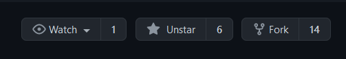
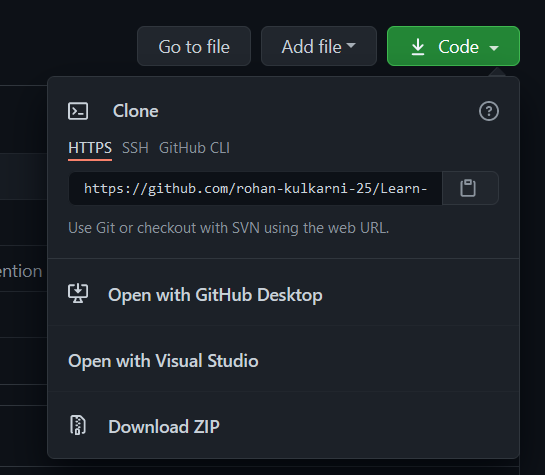
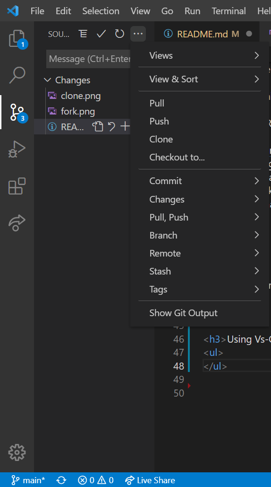
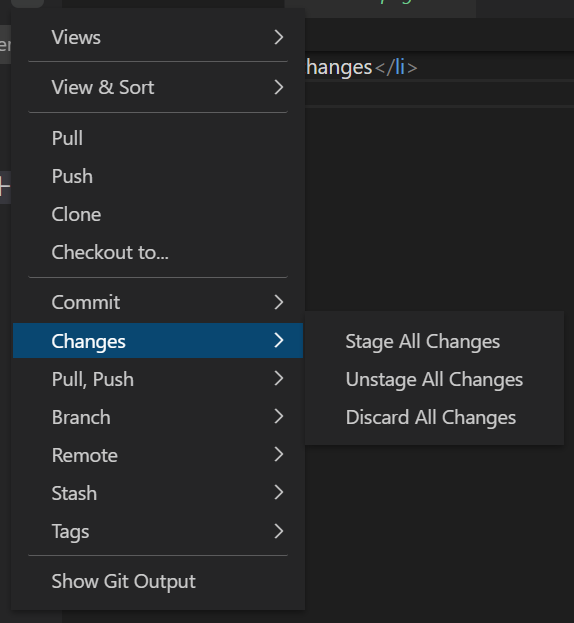
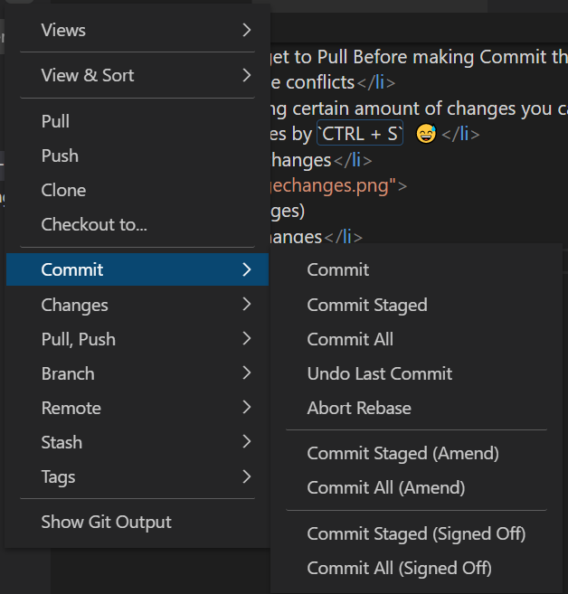
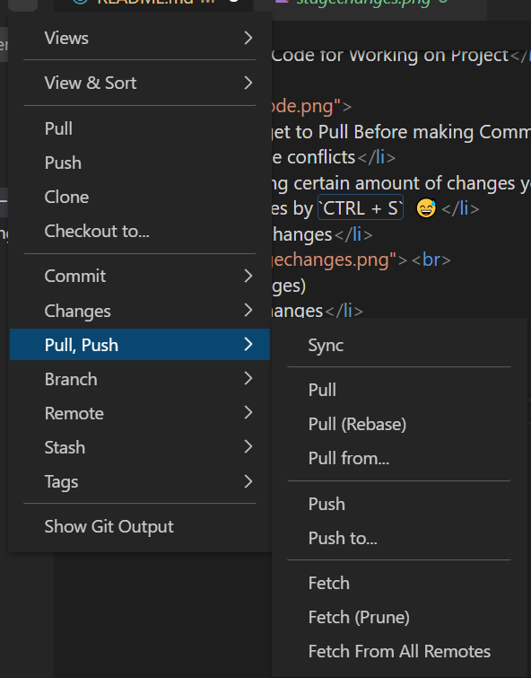
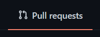
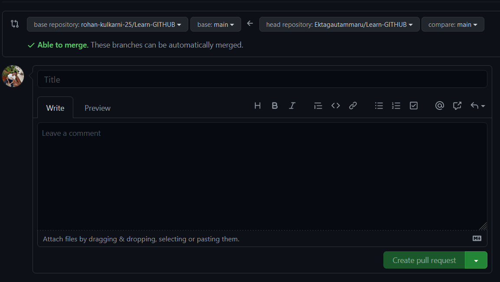

<h1 align="center">GITHUB + VS CODE </h1>

<a href="https://rohan-kulkarni-25.github.io/Learn-GITHUB/Tribute_To_Contributors.html">TRIBUTR TO CONTRIBUTORS</a>

<h2 align="center">⭐ STAR THIS REPOSITORY THIS WILL PAY OF MY WORK </h2>
 
<h3>Let's learn the basic workflow of Contribution on Open Source Projects ! </h3>  

<h2>There is also a HANDS ON DEMO CHECK BELOW ! </h2>
<h2><a href="https://rohan-kulkarni-25.github.io/Learn-GITHUB/">Check Learners</a></h2>

 
<h2>PREREQUISITES :-</h2>
<ul>
<li><h3>Github Account </h3</h3></li>
<li><h3>Laptop</h3></li>
<li><h3>The Most Important Dedication 😆</h3></li>
</ul> 

 
<h2>Git Setup :- </h2> 
<ul>
<li><h3><a href="https://git-scm.com/downloads">Download Git</a> as per your OS. </h3></li>
<li><h3>Install Git</h3></li>
<li><h3>Open the Git Bash ( Right Click )</h3></li>
<li><h3>Run the Commands</h3></li>

`$ git config --global user.name "Your Name"`

`$ git config --global user.email youremail@example.com`

`$ git config --list`

<li><h3>You Should see your entered name and email under `user.name` & `user.email`</h3></li>

</ul> 

 
<h2>Setting Project on Local System :- </h2> 
<ul>
<li><h3>Fork the Repository of Project</h3></li> 
  
( You will see this on Top Right of Github Repository !)  
<li><h3>Clone the Repository </h3></li> 
  
( Click on the Green Code button and Copy the link  `https://github.com/........` )</h3></li>  
<li><h3>Open Git bash where you want to clone the project ( Avoid On Desktop )</h3></li>
<li><h3>Run Command</h3></li>

`git clone link`

(In Place of link paste the link you copied)

<li><h3>Project Cloned in System</h3></li>
</ul> 

 

<h2>Using Vs-Code for Working on Project</h2> 
<ul>
  
<li><h3>Don't  Forget to Pull Before making Commit this will avoid merge conflicts</h3></li>
<li><h3>After Making certain amount of changes you can save the changes by `CTRL + S`  😅</h3></li>
<li><h3>Stage the changes</h3></li> 
 
(Stage All Changes)
<li><h3>Commit Changes</h3></li> 
 
(Commit Staged)
<li><h3>Push Changes</h3></li> 
 
(Push)
</ul> 

 

<h2>Creating Pull Request on Github</h2>
<ul>
<li><h3>Go in Pull Request Section</h3></li>

<li><h3>Create New Pull Request</h3></li>

<li><h3>Create New Pull Request</h3></li>

<li><h3>Add Title,  Description & Create Pull Request</h3></li>
<li><h3>That's It You have Succesfully Created a Pull Request</h3></li>
</ul>

<h2 align="center">HAND-ON DEMO</h2>

<h3>As you have learned to fork, clone, make changes and also to push those changes and even we learned to create Pull request ! </h3> 

<h3>Now You have one Task to do !!</h3> 
<h3>You have to create a issue. You will get option to create a issue as `Add Myself as Learner !!`</h3>   <h3>There is one file index.html you have to copy the text given below and paste the code in file !!</h3> 

<h3>After the src in image tag there is my username `rohan-kulkarni-25` In place of that you have to add your github username !! Make sure there is `.png` after you enter your username !! Also Enter you name In place of mine inside the `P` tag  !! Paste the edited content in index.html as per the sequence above the line `Paste here`</h3> 

<h3>You have to create a Pull Request and add `Fixes #IssueNumber` in description !! Issue number is the number of issue you created !</h3> 

COPY THIS 👇🏻

`
`
            `
`
                ``
                `
Rohan Kulkarni
`
            `
`
`
`

<h2 align="center">Connect with me  🤝🏻</h2>

<h3>

</h3>

## Add Myself as Learner !!
